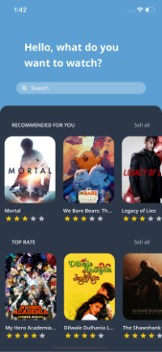
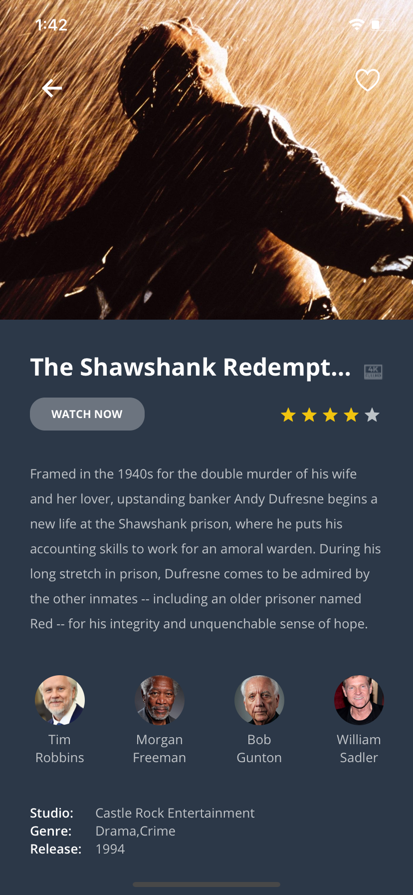

## Imagine Movie App React Native
Project made with React Native for knowledge test. [React](https://reactnative.dev/).

### Getting Started

#### Clone the app

```
git clone https://github.com/andycr95/moviesImagine
```

#### Install Dependancies

```
npm i
```

#### Add Configurations ( one time activity )

Create ```.env``` file in application root similar to ```.env.example```. Replace dummy values present in ```.env.example``` with your values.
Create acccount on MovieDB and generate API_MOVIE_KEY.

```javascript
# MovieDB API key
API_MOVIE_KEY='YOUR_API_KEY'

```

#### Link Dependancies ( one time activity )

``` JavaScript

// link Assets
react-native link

// link vector icons
react-native link react-native-vector-icons

```
#### Run Application

##### iOS Simulator
```
react-native run-ios

npm start
```

##### Android emulator

Start AVD (emulator) before following commands

```
react-native run-android

npm start
```

#### Bundle Application for Device

``` JavaScript
react-native bundle --entry-file index.js --platform ios --dev false --bundle-output ios/main.jsbundle --assets-dest ios
```

#### For Android

##### Generate keyStore file
Use following instructions to generate keystore file

https://facebook.github.io/react-native/docs/signed-apk-android.html

``` Javascript
 1. Update the alias and the password in the file android/gradle.properties
 2. Run cd android && ./gradlew assembleRelease; cd ..
 3. The Apk should be availabe at android/app/build/outputs/apk/
```

### Screens
<div id="screens" style="text-align:center width:500px"">
	
	
</div>
